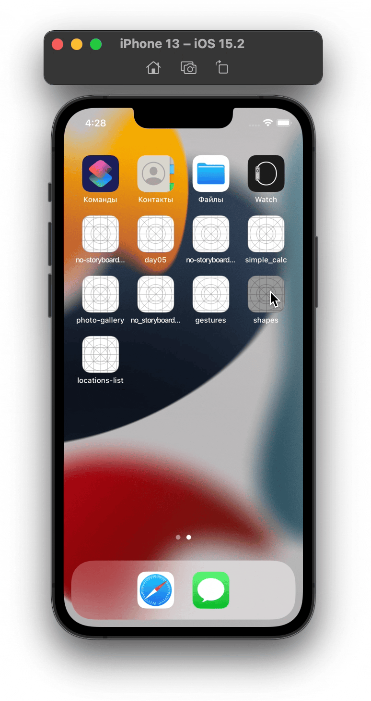
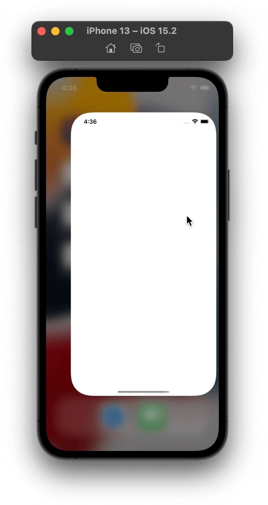

## **Shapes**

Creating random shapes (squares of circles) of random color by taping screen giving them physical properties.

## **Instruments**

UIKit

## **Features**
Gravity and collision behaviours for shapes.

Resizing and dragging shapes by pinch, pan and rotation gestures.